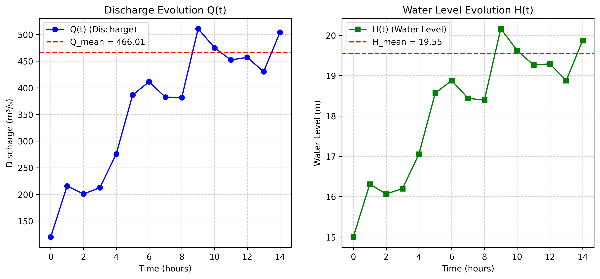
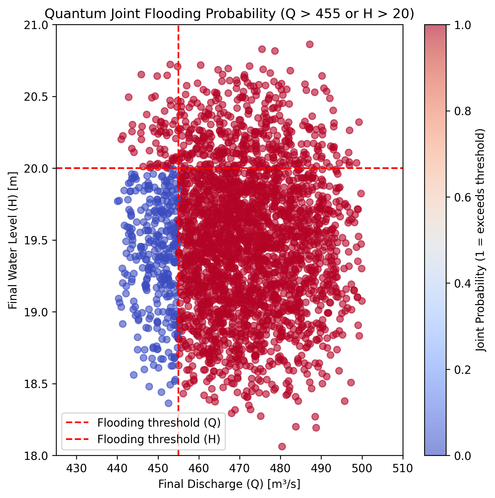
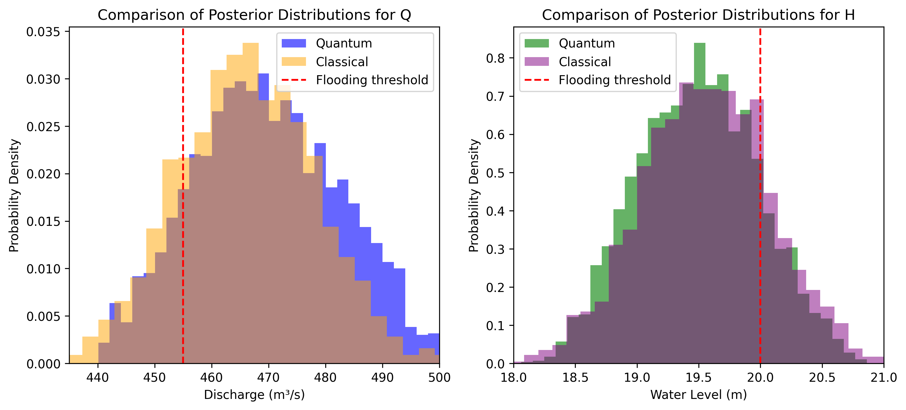

<div align="center">    
 
# QMS-Climate     

</div>

## Description   
Quantum software tool to execute climate risk models using quantum Bayesian inference.

## Installation  
First, install dependencies   

```bash
# clone project   
git clone https://github.com/roberCO/QMS-climate.git
```

Then we create a python environment
```
python3 -m venv qms-climate
source qms-climate/bin/activate
```

Then we must install a few packages
```
pip install numpyro
pip install pulser
```

Then we execute (example with 2 qubits and 1000 iterations)
```
python3 code/main.py 2 1000
```
<br>
<br>
<br>
The code is ready to simulate and example in which a flood is prediction

<div align="center">

</div>


<br>
<br>
<br>

The prediction with quantum analog Pasqal computer is centered in the right prediction.

<div align="center">

</div>


<br>
<br>
<br>


The comparison between classical and quantum algorithm shows how precise is the quantum algorithm

<div align="center">

</div>
